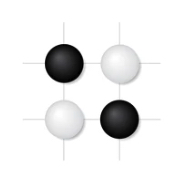

---
# Leave the homepage title empty to use the site title
title: ""
date: 2022-10-24
type: landing

design:
  # Default section spacing
  spacing: "6rem"

sections:
  # Original Biography Section
  - block: resume-biography-3
    content:
      username: admin
      text: ""
      button:
        text: Download CV
        url: uploads/resume.pdf
    design:
      css_class: dark
      background:
        color: black
        image:
          filename: stacked-peaks.svg
          filters:
            brightness: 1.0
          size: cover
          position: center
          parallax: false

  - block: markdown
    content:
      title: 'Projects'
      subtitle: "Research & Development"
      text: |
        ### 
        
        <strong>Enhancing Visual Detail Perception in Vision-Language Models</strong>
          
        - Aimed to improve fine-grained alignment between language and vision in models like CLIP by enhancing perception of visual details.  
        - Designed a novel plug-and-play spectral layer using frequency analysis to diversify image patch embeddings.  
        - Achieved a **12.6% accuracy boost** on the MMVP benchmark and surpassed diffusion-based methods by **7.4%**.  

        ### **Exploring How a Neural Network Plays the Go Game**  
        - Developed a game-theoretical framework to explain AI decision-making in Go.  
        - Identified crucial stone shapes influencing KataGo’s predictions.  
        - Discovered novel strategic patterns beyond traditional human knowledge.  

        ### **Research on Algorithms for Course Project Assigning**  

        - Designed a constraint-based matching algorithm inspired by the Hungarian algorithm.  
        - Optimized assignments to maximize student preferences.  
        - Received an **‘Excellent’** rating in SJTU’s Research Program.  
    design:
      columns: "1"  # Single column layout
      spacing:
        padding: ["30px", "0", "30px", "0"]
---